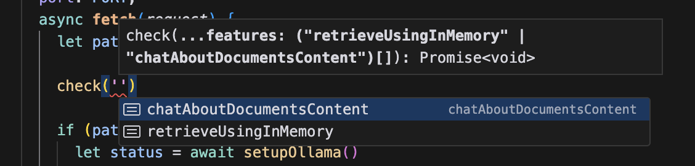

#### Check if the feature/function is available and run



```ts
let availableFeatures = {
  retrieveUsingInMemory: (await import('./in-memory-vectorstore'))
    .retrieveUsingInMemory,
  chatAboutDocumentsContent: (await import('./chat-about-documents-content'))
    .chatAboutDocumentsContent,
};

type Features = keyof typeof availableFeatures;

export async function run(...features: Features[]) {
  for (let feature of features) {
    void availableFeatures?.[feature]?.();
  }
}
```

