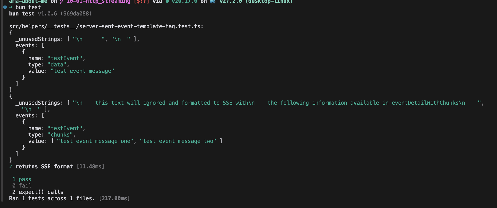

#### Tagged templates for formatting Server Sent Events


```ts
export function serverSentEvent(
    _unusedStrings: TemplateStringsArray, 
    ...events: Array<Event>
  ) {  
  let eventStreamContent = events.map(event => {
    let value;

    if (event.type === 'data') {
      value = `data: ${event.value}`
    }

    if (event.type === 'chunks') {
      value = event.value.map((v: string) => `data: ${v}`).join('\n')
    }

    if (event.name) {
      return `event: ${event.name}\n${value}`
    }

    return `${value}`
  }).join('\n\n')
  
  
  // The double newline at the end is crucial. Not mentioned in 
  // The documentation https://developer.mozilla.org/en-US/docs/Web/API/Server-sent_events/Using_server-sent_events#event_stream_format
  // Figured out by Claude AI 🙏
  // For more info: https://web.dev/articles/eventsource-basics
  return `${eventStreamContent}\n\n`;
}
```

```ts
let eventDetailWithChunks = {
    name: 'testEvent', 
    type: 'chunks', 
    value: ['test event message one', 'test event message two'],
  } as Event;


  let actualServerSentEventWithChunks = serverSentEvent`
    this text will ignored and formatted to SSE with
    the following information available in eventDetailWithChunks
    ${eventDetailWithChunks}
  `

  let expectedServerSentEventWithChunks = `
event: ${eventDetailWithChunks.name}
data: ${eventDetailWithChunks.value[0]}
data: ${eventDetailWithChunks.value[1]}

`.trimStart()

  expect(actualServerSentEventWithChunks).toEqual(expectedServerSentEventWithChunks)
```



### References

- https://developer.mozilla.org/en-US/docs/Web/JavaScript/Reference/Template_literals#tagged_templates